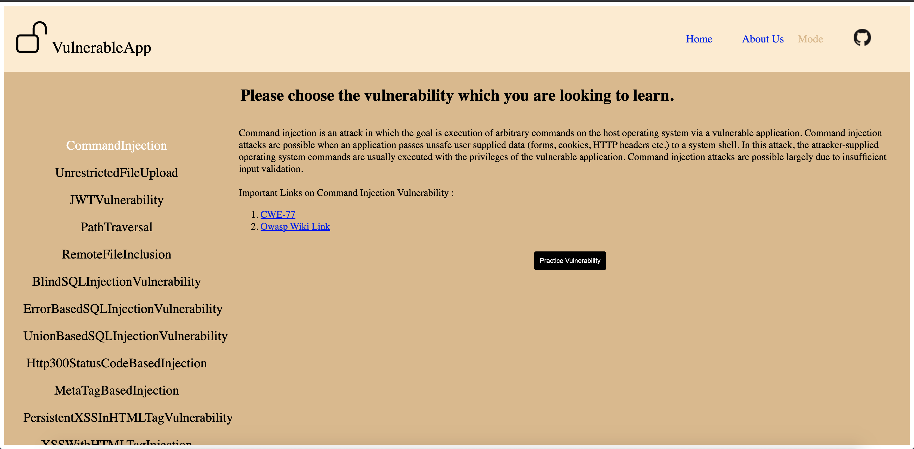
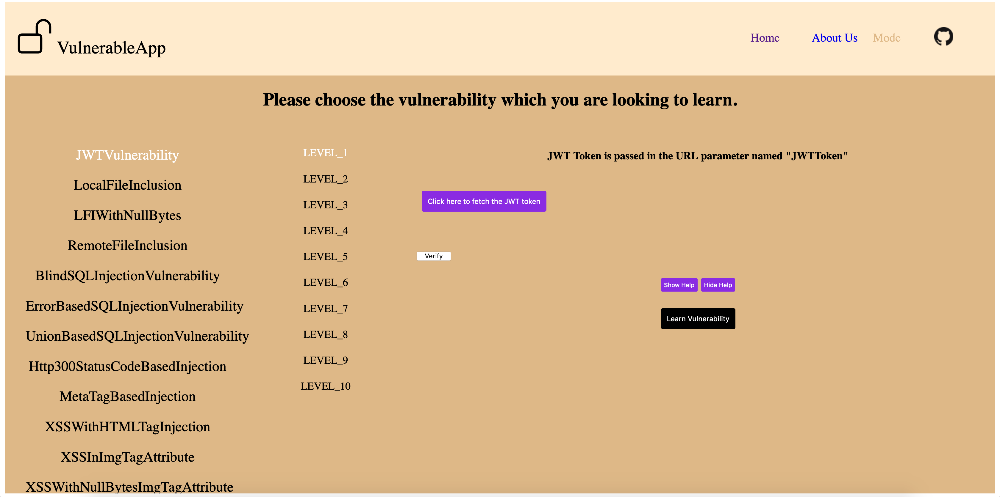

# How to start this tool #

## New UI
Running it in newer **React based User Interface**, Visit [Owasp VulnerableApp-facade UI](https://github.com/SasanLabs/VulnerableApp-facade). VulnerableApp-Facade is integrated with Owasp VulnerableApp. In order to run it, visit [Simple Start](https://github.com/SasanLabs/VulnerableApp-facade#simple-start)

## Legacy UI
1. Running it as a **docker container**, Please visit [Docker Repository](https://hub.docker.com/r/sasanlabs/owasp-vulnerableapp)
2. Running it as an **executable**, downloading released jar from [Releases](https://github.com/SasanLabs/VulnerableApp/releases) and run the application by executing following command `java -jar  VulnerableApp-1.0.0.jar`
3. Running it by **Building manually**, as VulnerableApp is a spring boot based application so for starting this application you need to import this project in IDE like eclipse or intellij. IDE should have buildship/gradle plugin. As this project is developed in eclipse so eclipse is recommended IDE for now.
After importing the project, run the app and it should start a server.

Navigate to `http://<base-url>:9090/VulnerableApp` , for eg: `http://localhost:9090/VulnerableApp` url and a User Interface will guide you to next steps.

# How can Vulnerability Scanning tools use VulnerableApp ? #
VulnerableApp is specifically designed for the Vulnerability Scanning Tools like ZAP wherein we expose vulnerability definitions via the following endpoints
Following are the endpoints exposed:
- `VulnerableApp/scanner`
- `VulnerableApp/sitemap.xml`

### Scanner Endpoint ###
Scanner is a specifically crafted endpoint to provide information about each vulnerability present in VulnerableApp.
#### Sample Json Response ####
```
[
  {
    "url": "http://192.168.0.148:9090/vulnerable/JWTVulnerability/LEVEL_1",
    "location": "QUERY_PARAM",
    "parameter": "JWT",
    "method": "GET",
    "vulnerabilityTypes": [
      "CLIENT_SIDE_VULNERABLE_JWT"
    ]
  }
]
```
Following is the Json Response explanation:
- url of the vulnerable endpoint
- location of the parameter like Query Param/Header etc.
- method like GET/POST accepted by vulnerable endpoint
- parameter name which represents the input to the endpoint
- type of vulnerabilities exposed by the endpoint

As Vulnerability Scanning Tools use `sitemap.xml`, `robots.txt` etc. in order to find the exposed endpoints so we have provided sitemap which provides all the vulnerable endpoints present in the VulnerableApp. For a better usage of VulnerableApp, Vulnerability Scanning tools need to understand the output of `VulnerableApp/scanner` endpoint and that information alone can suffice for all needs. 


## Glimpse of React based User Interface ##


## Glimpse of the Legacy User Interface ##
Tool's Starting Screen:


On Clicking **Learn Security** following screen pops up:

This screen contains the List of Vulnerabilities, there information and useful links for learning more about them.

On Clicking **Practice Vulnerability** following screen pops up:

This screen contains list of Levels present under the selected vulnerability, help at each level etc.

### Get Set Go for the Journey of Learning about the Web Application Security ###
