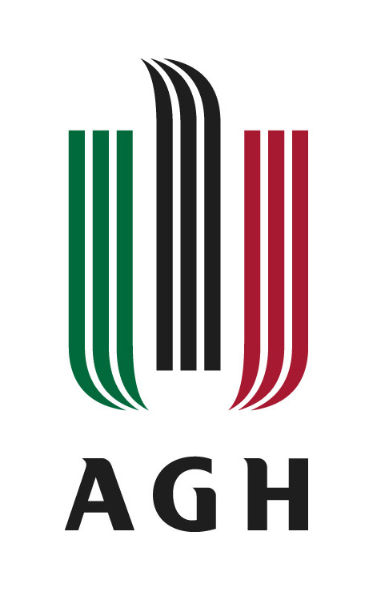
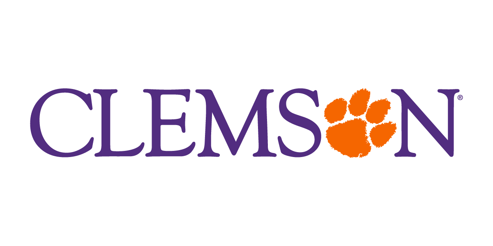
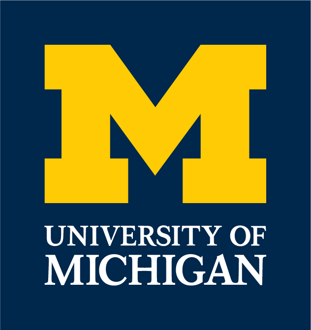

---

## 🌍 Global Academic Interest

VulnerableApp is actively explored by students, educators, and security enthusiasts across the world.

We regularly receive engagement (contributions, coursework usage, research interest) from universities such as:

* <a href="https://www.agh.edu.pl/en/">
  
  <strong>AGH University of Kraków</strong> — Poland 🇵🇱

</a>

* <a href="https://nus.edu.sg/">
  
  <strong>National University of Singapore</strong> — Singapore 🇸🇬

</a>

* <a href="https://www.univ-rouen.fr/university-of-rouen-normandy/">
  
  <strong>University of Rouen Normandy</strong> — France 🇫🇷

</a>

* <a href="https://case.edu/">
  
  <strong>Case Western Reserve University</strong> — United States 🇺🇸

</a>

* <a href="https://www.clemson.edu/">
  
  <strong>Clemson University</strong> — United States 🇺🇸

</a>

* <a href="https://umich.edu/">
  
  <strong>University of Michigan</strong> — United States 🇺🇸

</a>

---

💬 **Students and contributors typically reach out for:**

* Contributing to the project
* Using it in coursework and research
* Learning practical application security

> ⚠️ Note: Mentions and logos are based on community interactions (e.g., student outreach,  contributions) and do not imply official institutional endorsement.

