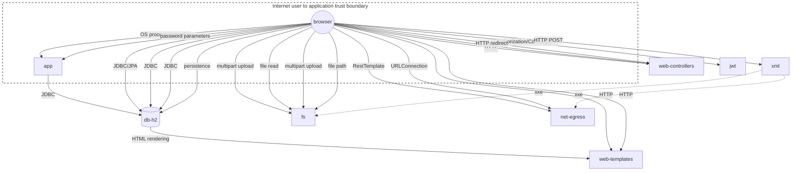

# Threat Model Report — unknown

> Generated: 2026-02-27T11:01:46.207Z  
> Files scanned: 230 | Annotations: 128

## Executive Summary

| Metric | Count |
|--------|-------|
| Assets | 10 |
| Threats defined | 10 |
| Controls defined | 11 |
| Active mitigations | 15 |
| Accepted risks | 0 |
| **Unmitigated exposures** | **0** |
| Data flows | 21 |
| Trust boundaries | 1 |
| Risk transfers | 2 |
| Validations | 0 |
| Ownership records | 0 |

## Threat Model Diagram

## 🛡 Active Mitigations

| Asset | Threat | Control | Description | Location |
|-------|--------|---------|-------------|----------|
| #app | #cmdi | #cmd-avoidance | Later levels attempt input validation/allowlisting | src/main/java/org/sasanlabs/service/vulnerability/commandInjection/CommandInjection.java:31 |
| #app | #crypto-fail | #salted-sha256 | LEVEL_5 demonstrates salt+SHA-256 (still not a re… | src/main/java/org/sasanlabs/service/vulnerability/cryptographicFailures/CryptographicFailuresVulnerability.java:34 |
| #fs | #file-upload | #upload-validation | Secure levels attempt type/extension checks and e… | src/main/java/org/sasanlabs/service/vulnerability/fileupload/UnrestrictedFileUpload.java:45 |
| #jwt | #jwt-weak | #jwt-strong-validation | Secure levels demonstrate stronger validation and… | src/main/java/org/sasanlabs/service/vulnerability/jwt/JWTVulnerability.java:50 |
| #web-controllers | #open-redirect | #redirect-allowlist | Later levels introduce parsing and allowlists | src/main/java/org/sasanlabs/service/vulnerability/openRedirect/Http3xxStatusCodeBasedInjection.java:52 |
| #fs | #path-traversal | #path-allowlist | Some levels constrain to allowlisted filenames or… | src/main/java/org/sasanlabs/service/vulnerability/pathTraversal/PathTraversalVulnerability.java:35 |
| #net-egress | #ssrf | #egress-filtering | A real fix would be strict allowlisting and block… | src/main/java/org/sasanlabs/service/vulnerability/rfi/UrlParamBasedRFI.java:27 |
| #db-h2 | #sqli | #prepared-stmts | Secure levels use parameters/typed queries | src/main/java/org/sasanlabs/service/vulnerability/sqlInjection/BlindSQLInjectionVulnerability.java:32 |
| #db-h2 | #sqli | #prepared-stmts | Secure levels use parameterized queries | src/main/java/org/sasanlabs/service/vulnerability/sqlInjection/ErrorBasedSQLInjectionVulnerability.java:32 |
| #db-h2 | #sqli | #prepared-stmts | LEVEL_4+ uses bound parameters / JPA criteria/nam… | src/main/java/org/sasanlabs/service/vulnerability/sqlInjection/UnionBasedSQLInjectionVulnerability.java:38 |
| #net-egress | #ssrf | #egress-filtering | LEVEL_5 effectively allowlists a single expected … | src/main/java/org/sasanlabs/service/vulnerability/ssrf/SSRFVulnerability.java:33 |
| #web-templates | #xss | #output-encoding | Secure levels escape output before rendering | src/main/java/org/sasanlabs/service/vulnerability/xss/persistent/PersistentXSSInHTMLTagVulnerability.java:25 |
| #xml | #xxe | #disable-xxe | LEVEL_3-5 configure parser to disable DTD and ext… | src/main/java/org/sasanlabs/service/vulnerability/xxe/XXEVulnerability.java:54 |
| #web-templates | #xss | #output-encoding | Secure levels use escaping/allowlisting for safe … | src/main/java/org/sasanlabs/service/vulnerability/xss/reflected/XSSInImgTagAttribute.java:29 |
| #web-templates | #xss | #output-encoding | LEVEL_4-5 escape/encode output before rendering | src/main/java/org/sasanlabs/service/vulnerability/xss/reflected/XSSWithHtmlTagInjection.java:26 |

## 🔒 Trust Boundaries

| Side A | Side B | Boundary ID | Description | Location |
|--------|--------|-------------|-------------|----------|
| #browser | #app | bdy-browser-app | Internet user to application trust boundary | src/main/java/org/sasanlabs/Application.java:11 |

## 📊 Data Flows

| Source | Target | Mechanism | Description |
|--------|--------|-----------|-------------|
| #browser | #web-controllers | HTTP | All requests enter via Spring MVC controllers |
| #app | #db-h2 | JDBC | Initializes schemas/data and provides JdbcTemplat… |
| #browser | #fs | multipart upload | Some endpoints intentionally allow risky file upl… |
| #browser | #web-controllers | HTTP | Enumerates endpoints and returns JSON/XML to clie… |
| #browser | #app | OS process execution | Request param influences the executed command line |
| #browser | #app | password parameters | User guesses are compared against weakly protecte… |
| #browser | #fs | file read | Path variable `fileName` selects a file under the… |
| #browser | #fs | multipart upload | User-controlled file content/name influences what… |
| #browser | #jwt | Authorization/Cookie parameters | JWTs are generated/validated based on client-prov… |
| #browser | #web-controllers | HTTP redirect | Client navigation target is controlled by request… |
| #browser | #fs | file path | Request param `fileName` influences file/resource… |
| #browser | #net-egress | RestTemplate | Outbound request destination is controlled by req… |
| #browser | #db-h2 | JDBC/JPA | Request param `id` is appended/used in SQL/JPA qu… |
| #browser | #db-h2 | JDBC | Request param `id` is appended to SQL |
| #browser | #db-h2 | JDBC | Request param `id` influences queries executed ag… |
| #browser | #net-egress | URLConnection | Outbound request target is derived from request p… |
| #browser | #db-h2 | persistence | User input is stored and later retrieved for rend… |
| #db-h2 | #web-templates | HTML rendering | Stored content becomes part of HTML response |
| #browser | #xml | HTTP POST | Request body XML is parsed server-side |
| #browser | #web-templates | HTTP | Untrusted `src` param is reflected into HTML attr… |
| #browser | #web-templates | HTTP | User input is reflected into HTML payloads |

## 🔀 Risk Transfers

| Source | Threat | Target | Description | Location |
|--------|--------|--------|-------------|----------|
| #xml | #xxe | #fs | XXE can be used to read local files via external … | src/main/java/org/sasanlabs/service/vulnerability/xxe/XXEVulnerability.java:52 |
| #xml | #xxe | #net-egress | XXE can trigger outbound HTTP requests via extern… | src/main/java/org/sasanlabs/service/vulnerability/xxe/XXEVulnerability.java:53 |

## 🔍 Audit Items

- **#db-h2** — Confirm DB user/permissions model matches intended blast-radius limitations for injection demos (src/main/java/org/sasanlabs/configuration/VulnerableAppConfiguration.java:44)
- **#fs** — MultipartFilter overrides max upload size for specific paths; ensure it is limited to demo endpoints only (src/main/java/org/sasanlabs/configuration/VulnerableAppConfiguration.java:45)
- **#app** — Confirm any validation-based 'secure' levels cannot be bypassed (regex + allowlist is preferred) (src/main/java/org/sasanlabs/service/vulnerability/commandInjection/CommandInjection.java:32)
- **#app** — Even 'SHA-256 + salt' examples are not password hashing; prefer slow KDFs (bcrypt/scrypt/Argon2) in real apps (src/main/java/org/sasanlabs/service/vulnerability/cryptographicFailures/CryptographicFailuresVulnerability.java:35)
- **#fs** — Consider normalizing and validating resolved paths to prevent traversal outside upload root (src/main/java/org/sasanlabs/service/vulnerability/fileupload/PreflightController.java:29)
- **#fs** — Uploads should ideally be stored outside any web-served path; confirm demo behavior is intentional (src/main/java/org/sasanlabs/service/vulnerability/fileupload/UnrestrictedFileUpload.java:46)
- **#jwt** — Review that demo tokens/keys are not reused in non-demo contexts; confirm header parsing and algorithm selection are strict in secure paths (src/main/java/org/sasanlabs/service/vulnerability/jwt/JWTVulnerability.java:51)
- **#web-templates** — If implemented, ensure any client-side redirects use strict allowlists and safe URL parsing (src/main/java/org/sasanlabs/service/vulnerability/openRedirect/ClientSideInjection.java:4)
- **#web-controllers** — URL parsing/normalization is tricky; ensure allowlist checks are done on a canonicalized URL (src/main/java/org/sasanlabs/service/vulnerability/openRedirect/Http3xxStatusCodeBasedInjection.java:53)
- **#web-templates** — If re-enabled, treat meta-refresh destinations as open redirect and enforce #redirect-allowlist (src/main/java/org/sasanlabs/service/vulnerability/openRedirect/MetaTagBasedInjection.java:30)
- **#web-controllers** — If implemented, treat as open redirect and apply strict allowlisting/canonicalization (src/main/java/org/sasanlabs/service/vulnerability/openRedirect/RefreshHeaderBasedInjection.java:4)
- **#fs** — This reads classpath resources; confirm the demo doesn't unintentionally expose secrets from packaged resources (src/main/java/org/sasanlabs/service/vulnerability/pathTraversal/PathTraversalVulnerability.java:36)
- **#net-egress** — Current levels appear intentionally permissive; confirm this remains confined to the demo controller (src/main/java/org/sasanlabs/service/vulnerability/rfi/UrlParamBasedRFI.java:28)
- **#db-h2** — Confirm any time-based/behavior-based inference helpers are limited to demo endpoints (src/main/java/org/sasanlabs/service/vulnerability/sqlInjection/BlindSQLInjectionVulnerability.java:33)
- **#db-h2** — Ensure exception messages returned to clients are limited to demo levels only (src/main/java/org/sasanlabs/service/vulnerability/sqlInjection/ErrorBasedSQLInjectionVulnerability.java:33)
- **#db-h2** — Double-check any remaining string-built query paths stay confined to demo levels only (src/main/java/org/sasanlabs/service/vulnerability/sqlInjection/UnionBasedSQLInjectionVulnerability.java:39)
- **#net-egress** — Filtering currently checks protocol and metadata host; confirm bypasses are acceptable for the demo intent (src/main/java/org/sasanlabs/service/vulnerability/ssrf/SSRFVulnerability.java:34)
- **#db-h2** — Confirm per-level isolation prevents cross-level contamination of stored payloads (src/main/java/org/sasanlabs/service/vulnerability/xss/persistent/PersistentXSSInHTMLTagVulnerability.java:26)
- **#xml** — Verify any global XML properties (javax.xml.accessExternalDTD) are scoped to demo usage and don't leak to other modules (src/main/java/org/sasanlabs/service/vulnerability/xxe/XXEVulnerability.java:55)
- **#web-templates** — Attribute context escaping differs from element-body escaping; ensure chosen encoders match context (src/main/java/org/sasanlabs/service/vulnerability/xss/reflected/XSSInImgTagAttribute.java:30)
- **#web-templates** — Ensure templates correctly close tags (LEVEL_1 uses '
%s
') to avoid confusing downstream parsers (src/main/java/org/sasanlabs/service/vulnerability/xss/reflected/XSSWithHtmlTagInjection.java:27)

## 💬 Developer Comments

Security-relevant notes left by developers via `@comment`.

- Wires core assets: i18n, attack vector payloads, DB initialization, and multipart handling used by vulnerable modules. (src/main/java/org/sasanlabs/configuration/VulnerableAppConfiguration.java:41)
- Top-level REST endpoints that enumerate and describe vulnerable endpoints for UI and scanners. (src/main/java/org/sasanlabs/controller/VulnerableAppRestController.java:25)
- Command injection demo: user-controlled input is concatenated into a shell command (ping). (src/main/java/org/sasanlabs/service/vulnerability/commandInjection/CommandInjection.java:28)
- Crypto failures demo: shows weak hashes/encodings and how they can be cracked or reversed. (src/main/java/org/sasanlabs/service/vulnerability/cryptographicFailures/CryptographicFailuresVulnerability.java:31)
- Serves previously uploaded files back to clients using Content-Disposition attachment. (src/main/java/org/sasanlabs/service/vulnerability/fileupload/PreflightController.java:27)
- Unrestricted file upload demo: multipart uploads are written to disk (and potentially served back). (src/main/java/org/sasanlabs/service/vulnerability/fileupload/UnrestrictedFileUpload.java:42)
- JWT vulnerability demos: weak signature validation/algorithms and unsafe token handling patterns. (src/main/java/org/sasanlabs/service/vulnerability/jwt/JWTVulnerability.java:47)
- Placeholder for client-side open redirect patterns (e.g., DOM-based navigation). Not currently implemented. (src/main/java/org/sasanlabs/service/vulnerability/openRedirect/ClientSideInjection.java:3)
- Open redirect demo: user-controlled returnTo influences Location header in 3xx responses. (src/main/java/org/sasanlabs/service/vulnerability/openRedirect/Http3xxStatusCodeBasedInjection.java:49)
- Currently disabled/placeholder implementation for meta-refresh based redirects. (src/main/java/org/sasanlabs/service/vulnerability/openRedirect/MetaTagBasedInjection.java:29)
- Placeholder for refresh-header based redirects. Not currently implemented. (src/main/java/org/sasanlabs/service/vulnerability/openRedirect/RefreshHeaderBasedInjection.java:3)
- Path traversal demo: user-controlled filename influences resource lookup and file reads. (src/main/java/org/sasanlabs/service/vulnerability/pathTraversal/PathTraversalVulnerability.java:32)
- RFI/URL fetch demo: server retrieves remote content from user-controlled URL and returns it. (src/main/java/org/sasanlabs/service/vulnerability/rfi/UrlParamBasedRFI.java:24)
- Template for adding new modules: add @asset/@threat/@control in `.guardlink/definitions.java`, then use @exposes/@mitigates/@flows/@audit here. (src/main/java/org/sasanlabs/service/vulnerability/sampleVulnerability/SampleVulnerability.java:19)
- Blind SQLi demo: injection is inferred from boolean/behavioral responses (true/false). (src/main/java/org/sasanlabs/service/vulnerability/sqlInjection/BlindSQLInjectionVulnerability.java:29)
- Error-based SQLi demo: string-concatenated queries produce observable errors and data leakage. (src/main/java/org/sasanlabs/service/vulnerability/sqlInjection/ErrorBasedSQLInjectionVulnerability.java:29)
- Demonstrates UNION-based SQL injection across multiple 'levels' (some intentionally vulnerable, some secure). (src/main/java/org/sasanlabs/service/vulnerability/sqlInjection/UnionBasedSQLInjectionVulnerability.java:35)
- SSRF demo: user-controlled URL is fetched server-side and response is returned. (src/main/java/org/sasanlabs/service/vulnerability/ssrf/SSRFVulnerability.java:30)
- Persistent XSS demo: untrusted comments are stored in DB and later rendered into HTML. (src/main/java/org/sasanlabs/service/vulnerability/xss/persistent/PersistentXSSInHTMLTagVulnerability.java:21)
- XXE demo: parses attacker-controlled XML into JAXB objects; some levels intentionally enable dangerous parser behavior. (src/main/java/org/sasanlabs/service/vulnerability/xxe/XXEVulnerability.java:49)
- Reflected XSS demo focused on HTML attribute context (``). (src/main/java/org/sasanlabs/service/vulnerability/xss/reflected/XSSInImgTagAttribute.java:26)
- Reflected XSS demo: untrusted query params are embedded into HTML responses. (src/main/java/org/sasanlabs/service/vulnerability/xss/reflected/XSSWithHtmlTagInjection.java:23)

---
*Generated by [GuardLink](https://guardlink.bugb.io) — Security annotations for code.*
